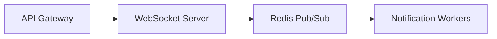

# Arete

*Arete (ἀρετή): excellence that cannot be given, only earned through effort.*

A brainstorming framework for Claude Code that challenges you instead of agreeing with you.

## Why This Exists

AI gives you the illusion of understanding. You prompt, it answers, you ship. But did you actually think it through, or did you just technically not be wrong?

Arete exists because:

**You should own your decisions.** When the system fails at 3 AM, you need to know *why* you chose WebSockets over polling—not just that Claude suggested it. ADRs capture the reasoning you earned through dialogue, not answers you received.

**Challenge creates growth.** A tool that always agrees with you is a mirror, not a mentor. Arete pushes back: "Why a jumphost?" "What are you protecting against?" "Who handles the key rotation?" The friction is the feature.

**Context compounds.** Session 10 builds on session 1. Your ADRs accumulate into a searchable decision history. New team members read *why* the event system uses polling—they don't interrupt you, they don't reverse-engineer the code. Past decisions surface when relevant because the files remember what you forget.

## Installation

Requires [Claude Code](https://claude.ai/code).

### Via Plugin Marketplace (Recommended)

Register the Arete marketplace:

```bash
/plugin marketplace add jesgarram/arete
```

Then install the plugin:

```bash
/plugin install arete@jesgarram/arete
```

### Manual Installation

Download and install manually:

```bash
git clone https://github.com/jesgarram/arete.git
cp -r arete ~/.claude/plugins/arete
```

After installation, restart Claude Code or run `/plugins reload` to activate the plugin.

## Quickstart

```bash
/brainstorm "Design a real-time notification system for 100K concurrent users"
```

Claude guides you through DIVERGE → CONVERGE → REFINE → EXPORT. You get an ADR in `context/exports/`.

## How It Works

```
Arete: "Why a jumphost?"
You:   We need to access the database in the VNet.
Arete: "What are you protecting it from?"
You:   External access. It's got sensitive data.
Arete: "So you're exposing an SSH endpoint to reach your most protected resource?"
You:   It's only accessible from our IP range.
Arete: "Who manages the patching? The key rotation?"
You:   ...I didn't think about that.
```

That moment—when you stop prompting and start thinking—is the point.

### The Workflow

```
DIVERGE  →  CONVERGE  →  REFINE  →  EXPORT
(explore)   (decide)     (stress)   (save)
```

**DIVERGE** — Explore widely. Zero judgment. Claude asks probing questions (80% questions, 20% statements). Generate 5+ directions before evaluating any.

**CONVERGE** — Force a decision. Claude extracts 3-5 approaches, presents a matrix showing what each sacrifices. You pick one path with explicit trade-off acceptance.

**REFINE** — Stress-test. "What at 10x scale?" "How debug at 3 AM?" "Single point of failure?" Simple (can 10 steps be 3?), Robust (what when this fails?), Elegant (does it feel inevitable?).

**EXPORT** — Save the artifact. Technical problems become ADRs. Conceptual problems become Outlines. Architecture diagrams auto-generated via mermaid.

## Output

ADRs include searchable frontmatter:

```yaml
---
problem: "Real-time notifications at 100K concurrent users"
date: 2025-01-11
---
```

Six months later, search your ADRs to find every decision about message distribution.

When you discuss component interactions, mermaid diagrams generate inline:



## Skills

The Arete plugin includes four core skills:

- **diverge** - Divergent thinking phase for exploration
- **converge** - Convergent thinking phase for decision making
- **refine** - Refinement phase for stress-testing and polishing
- **export** - Generate ADRs and outlines with architecture diagrams

Access via the `/brainstorm` command, which orchestrates all phases.

## Domain Knowledge

Arete loads domain-specific questions for:

**Technical domains:**
- Distributed Systems (CAP theorem, consistency, replication)
- Storage & Retrieval (OLTP vs OLAP, indexes, query patterns)
- Data Models (relational, document, graph, schema evolution)
- Batch & Stream Processing (lambda architecture, exactly-once)
- Partitioning (hot spots, rebalancing strategies)

**Conceptual domains:**
- Presentations (slide design, narrative arc, visual storytelling)
- Writing (technical writing, structure, clarity)
- Talks (stage presence, timing, audience interaction)
- Teaching (pedagogy, examples, learning progression)

## Customization

Add your own domain by creating a markdown file in:
- `skills/diverge/reference/technical/your-domain.md` (technical)
- `skills/diverge/reference/conceptual/your-domain.md` (conceptual)

Structure:

```markdown
# Your Domain

## Key Concepts

[The fundamental trade-off or tension in this domain]

## Questions

- Question that reveals hidden assumptions
- Question about failure modes
- Question about scale implications
- Question about trade-offs
```

## License

MIT
