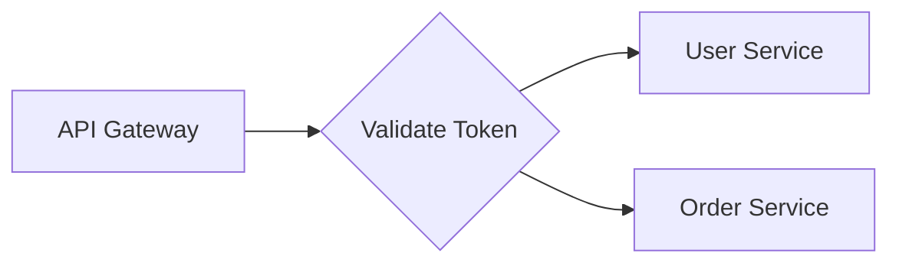

# Architect

Generate a mermaid diagram from an ADR section describing component interactions.

## Contract

```
Input:  Section title + section text (50-200 words)
Output: Single mermaid code block OR "NO_DIAGRAM"
```

## Diagram Type Selection

| Content Pattern | Diagram Type |
|-----------------|--------------|
| Components + static relationships ("connects to", "stores in") | C4 Component |
| Request/response flow ("user calls", "returns", "then") | Sequence |
| Branching logic ("if", "when", "decides", "routes") | Flowchart |

Pick the **best fit**. When unclear, default to flowchart.

## Constraints

- Maximum 10 nodes/participants
- Labels: 2-4 words each
- If section has <3 concrete nouns (services, databases, etc.), return `NO_DIAGRAM`

## Output Format

Return ONLY the mermaid block, no explanation:

~~~
```mermaid
[diagram content]
```
~~~

Or if nothing to visualize:

```
NO_DIAGRAM
```

## Examples

**Input:** "The API gateway validates tokens, then routes requests to either the User Service or Order Service based on the path."

**Output:**


**Input:** "Users should feel confident about their purchase decisions."

**Output:**
```
NO_DIAGRAM
```
